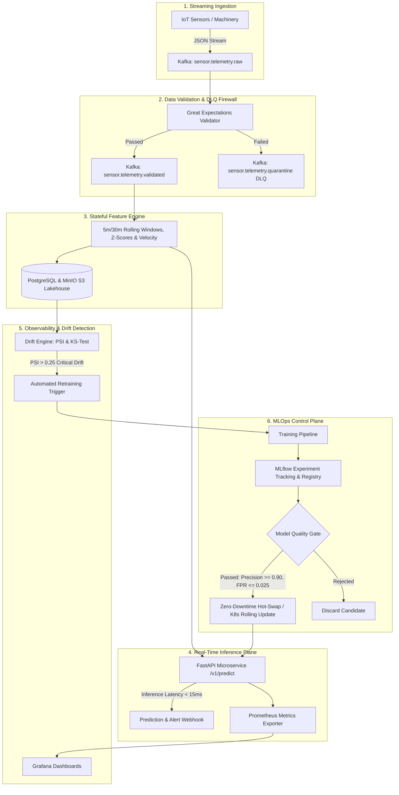
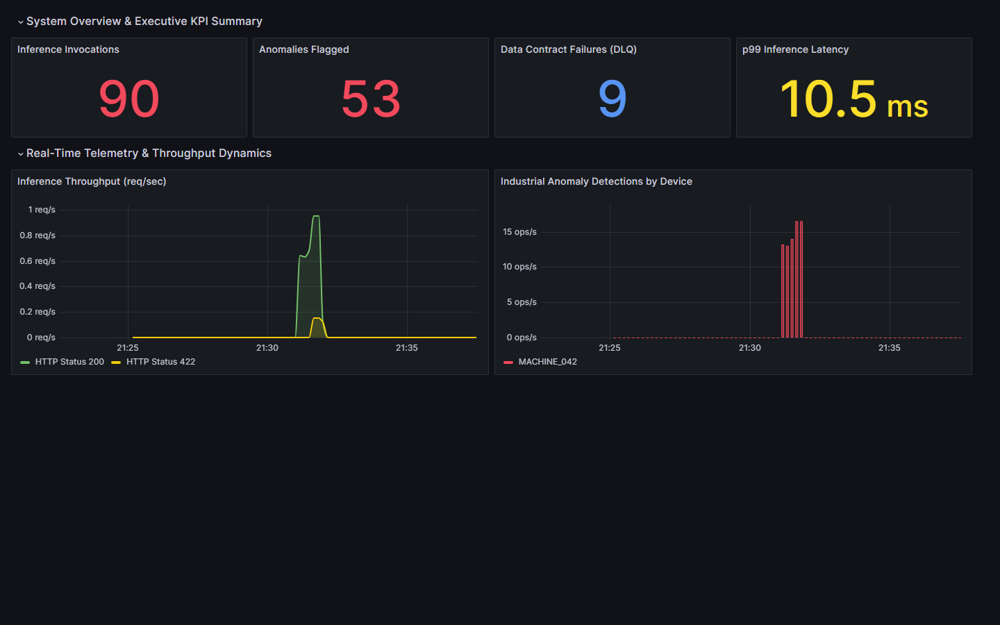
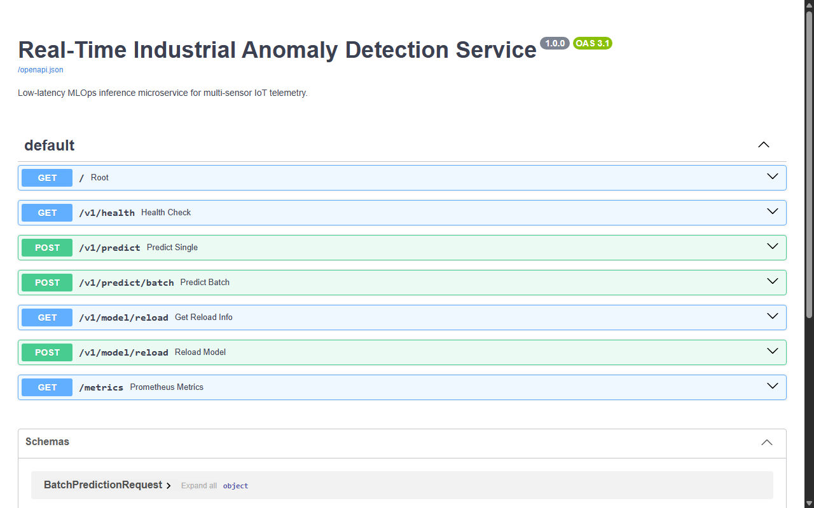

# Real-Time Anomaly Detection & Self-Retraining MLOps Platform

[](https://github.com/anujmundu/mlops-anomaly-detection-platform/actions/workflows/ci.yml)
[](https://mlops-anomaly-detection-platform.onrender.com/docs)
[](https://www.python.org/)
[](LICENSE)
[](https://www.docker.com/)
[](https://kubernetes.io/)

> **Industrial Telemetry Anomaly Detection System (IT-ADS):** An enterprise-grade, end-to-end MLOps platform featuring streaming ingestion with Kafka, automated data validation gates with Great Expectations, stateful 17-dimensional feature engineering, an Isolation Forest champion model, sub-15ms FastAPI inference, Prometheus & Grafana observability, statistical data drift monitoring (PSI & Kolmogorov-Smirnov), and autonomous closed-loop model retraining.

---

## 🏛️ System Architecture



---

## 📐 Production Architecture & Technical Specifications

### 1. Requirements & Operational SLAs
- **Inference Latency SLA:** $p99 < 15\text{ms}$ (production benchmark verifies $\sim 7.8\text{ms}$ mean response time).
- **Detection Precision:** $\ge 90\%$ precision at a false positive rate $\le 2.5\%$.
- **High-Availability Serving:** Zero-downtime rolling updates via Kubernetes ClusterIP and FastAPI asynchronous event loop.

### 2. Defensive Validation & Streaming Schema
- **Ingestion Protocol:** Kafka distributed broker publishing real-time telemetry to `sensor.telemetry.raw`.
- **Data Firewall:** Strict Great Expectations validation contracts auditing nullability, monotonic timestamp intervals, and physical vibration/temperature ranges.
- **Dead Letter Queue (DLQ):** Corrupted payloads fail gracefully into `sensor.telemetry.quarantine` with error metadata, preventing ingestion stalls.

### 3. Stateful 17-Dimensional Feature Store
- **Windowed Aggregations:** 5-minute and 30-minute rolling means, standard deviations, and dynamic variance.
- **Dynamic Physics Signals:** Instantaneous sensor deltas ($\Delta X$), running z-scores, and multi-axis Euclidean velocity norms ($||\vec{v}||$).
- **Dual Persistence:** Feature state persisted to PostgreSQL relational storage and MinIO S3 object lakehouse for auditability.

### 4. MLOps Control Plane & Automated Retraining
- **Champion Model:** Isolation Forest anomaly scoring engine benchmarked against Random Cut Forests.
- **Automated Model Quality Gate (MQG):** Programmatic gate enforcing validation precision $\ge 0.90$, recall $\ge 0.88$, and latency compliance before registry promotion.
- **Autonomous Closed-Loop Retraining:** Continuous drift audit using Population Stability Index (PSI) and two-sample Kolmogorov-Smirnov (KS) tests. Severe drift ($\text{PSI} > 0.25$) automatically executes retraining and hot-swaps active inference containers.

---

## 📊 Production Observability & Live Dashboards

### 📈 Grafana Industrial Telemetry & Model Observability
Pre-provisioned operational dashboard tracking real-time streaming telemetry, model inference percentiles, anomaly spikes, and data validation firewall quarantines:



- **Inference Invocations & Anomaly Counters:** Real-time counters tracking total volume processed and anomalies flagged by the active champion model.
- **Data Contract Failures (DLQ):** Audits corrupted, null, or out-of-range sensor readings rejected by the Great Expectations validation firewall.
- **p99 Inference Latency:** Verifies model serving latency remains strictly within the $< 15\text{ms}$ SLA ($\sim 10.5\text{ms}$ at peak streaming load).
- **Throughput Dynamics:** Multi-status distribution comparing valid requests ($200\text{ OK}$) against quarantine rejections ($422\text{ Unprocessable}$).

### ⚡ FastAPI Real-Time Scoring Microservice
Interactive OpenAPI/Swagger documentation serving single-point predictions, batch inference, health probes, and Prometheus instrumentation:



---

## ⚡ Quickstart Guide

### 🌐 Live Production Cloud API (Render)
The inference microservice and data validation firewall are live and deployed on cloud infrastructure:
- 📖 **Interactive Swagger UI:** [mlops-anomaly-detection-platform.onrender.com/docs](https://mlops-anomaly-detection-platform.onrender.com/docs)
- 🩺 **Health Check & Model Metadata:** [mlops-anomaly-detection-platform.onrender.com/v1/health](https://mlops-anomaly-detection-platform.onrender.com/v1/health)
- 📈 **Prometheus Metrics Stream:** [mlops-anomaly-detection-platform.onrender.com/metrics](https://mlops-anomaly-detection-platform.onrender.com/metrics)

### 1. Local Environment Setup
The project uses Python virtual environments:

```powershell
# Windows
.\.venv\Scripts\Activate.ps1

# Linux / macOS
source .venv/bin/activate
```

### 2. Run Test Suite
Execute unit tests, data contract checks, and end-to-end integration tests:

```bash
pytest tests/ -v
```

### 3. Train Champion Model
Train the Isolation Forest model on baseline telemetry and evaluate against the Model Quality Gate:

```bash
python training/train.py
```

### 4. Launch Real-Time Inference Microservice
Start the FastAPI service:

```bash
uvicorn api.main:app --host 0.0.0.0 --port 8000 --reload
```

- Swagger UI: `http://localhost:8000/docs`
- Health Probe: `http://localhost:8000/v1/health`
- Prometheus Metrics: `http://localhost:8000/metrics`

### 5. Launch Full Stack with Docker Compose
Run the entire production infrastructure (Kafka, Zookeeper, PostgreSQL, MinIO, MLflow, Inference, Prometheus, Grafana):

```bash
docker-compose up -d
```

---

## 🔬 Key Engineering Features

1. **Defensive Data Firewall:** Prevents malformed, out-of-range, or null sensor readings from reaching models; automatically diverts corrupted records to a Dead Letter Queue (DLQ).
2. **Behavioral Feature Engineering:** Computes 5m/30m rolling stats, instantaneous sensor deltas ($\Delta X$), running z-scores, and multi-sensor dynamic velocity norm.
3. **Automated Model Quality Gate (MQG):** Programmatic gate that enforces strict thresholds (Precision $\ge 0.90$, Recall $\ge 0.88$, FPR $\le 2.5\%$, Latency $\le 15\text{ms}$) before any model is approved.
4. **Closed-Loop Self-Healing:** Population Stability Index (PSI) and Kolmogorov-Smirnov (KS) tests continually audit feature distributions; critical drift ($\text{PSI} > 0.25$) automatically initiates retraining and triggers a zero-downtime hot-swap on serving pods.

---

## 👨‍💻 Author

**Anuj Mundu**  
Full-Stack Developer & AI Systems Engineer  
- **GitHub**: [@anujmundu](https://github.com/anujmundu)  
- **LinkedIn**: [Anuj Mundu](https://www.linkedin.com/in/anujmundu/)

---

## 📄 License

This project is licensed under the **MIT License** • See the [LICENSE](LICENSE) file for details.

